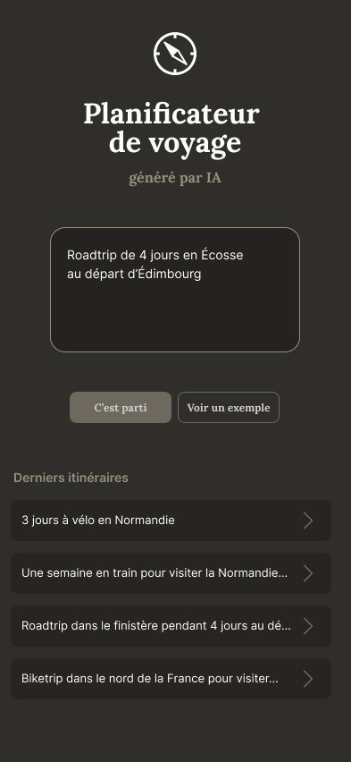
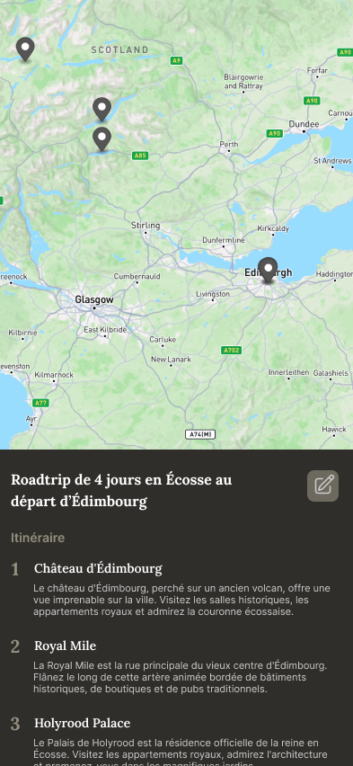

# Planificateur de voyage

Ce projet concerne la version front-end de l'application 

Ce projet consiste en un planificateur de voyage intégrant un modèle d'IA conversationnelle. L'utilisateur saisit ses préférences de voyage dans un champ texte, puis l'application génère un itinéraire sur une carte ainsi qu'une liste d'étapes correspondantes. Il peut ensuite ajuster ses préférences et mettre à jour l'itinéraire. Les itinéraires sont sauvegardés en base de données et les dernières recherches sont affichées sur la page d'accueil, sans nécessité de création de compte.

Url du code du Front : https://github.com/KarimHaddadi20/trip_planner_back

# Page d'Accueil

# Page Itinéraires 

